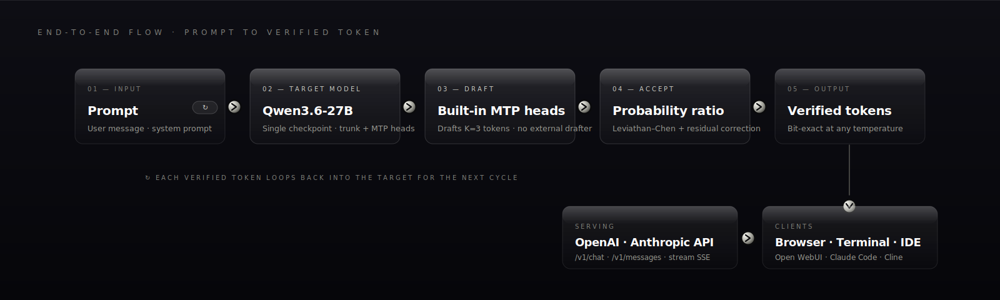
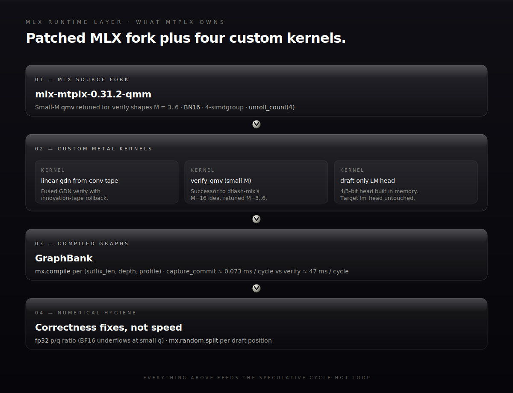
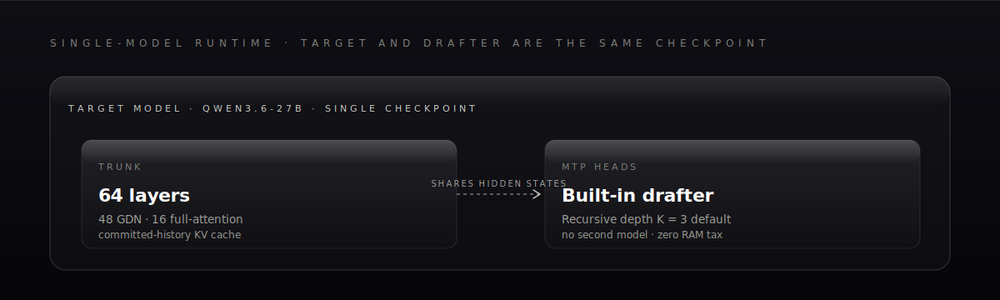
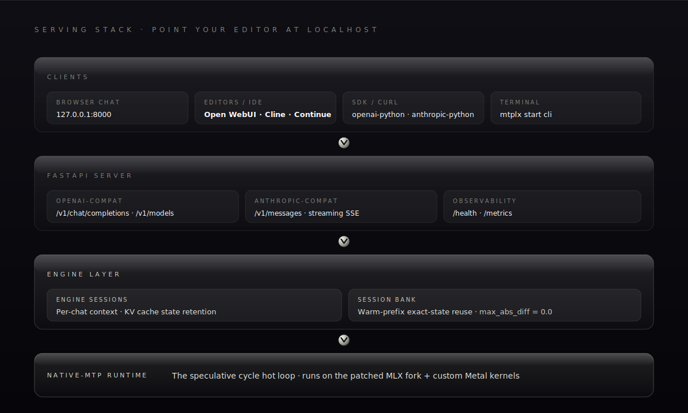

<div align="center">


# **Native MTP speculative decoding on Apple Silicon**

**~2.24× over no-MTP AR at `temp=0.6`** on Qwen3.6-27B · math-correct rejection sampling · MLX-native · zero external drafter

<sub>Multiplier is hardware-independent. Absolute tok/s scales with memory bandwidth — current public record on M5 Max: **63.056 / 62.886 tok/s** D3, [`Youssofal/Qwen3.6-27B-MTPLX-Optimized-Speed`](https://huggingface.co/Youssofal/Qwen3.6-27B-MTPLX-Optimized-Speed).</sub>

[](https://github.com/youssofal/mtplx/actions/workflows/ci.yml)
[](https://pypi.org/project/mtplx/)
[](https://www.python.org/)
[](https://developer.apple.com/metal/)
[](CHANGELOG.md)
[](LICENSE)

</div>

---

**Permissive open source.** MTPLX is Apache-2.0: you can use it, modify it, and ship it commercially. If you redistribute MTPLX, keep the license and NOTICE attribution; for public projects and research, visible credit or citation is strongly appreciated.

MTPLX runs **the model's own built-in MTP heads** as a speculative drafter, with **exact probability-ratio acceptance + residual correction** — not the greedy-argmax trick most fast-decode tools use at T>0. That means real coding settings (`temperature=0.6`, `top_p=0.95`, `top_k=20`) actually get the speculative speedup *and* keep the target model's distribution.

This is **not** DFlash, DDTree, llama-spec, or an external-drafter system. It's a native-MTP runtime built around MLX, Apple Silicon, and a real OpenAI/Anthropic-compatible serving surface.

Install:

```bash
brew install youssofal/mtplx/mtplx
mtplx start            # interactive: pick model → mode → web/CLI, then chat
```

The Homebrew installer sets up the `mtplx` command in `/opt/homebrew/bin` and bootstraps the Python runtime under `/opt/homebrew/var/mtplx`. Python users can also run `python3 -m pip install --pre mtplx`.

That's it. The wizard handles the default speed model (`Youssofal/Qwen3.6-27B-MTPLX-Optimized-Speed`), runtime mode, and surface (browser chat at `127.0.0.1:8000/` or terminal chat) on first run. On every subsequent run it asks "same as last time?" so you're one keypress from chatting.

---

## What you get

- **Native MTP speculative decoding.** Built-in MTP heads, no external drafter, no RAM hit for a second model.
- **Math-correct sampling at T=0.6.** Probability-ratio acceptance with residual correction. Verified `max_diff = 0.0` against reference single-token AR on the verified Qwen3.6-27B path.
- **~2.24× over no-MTP AR at `temp=0.6`.** The hardware-independent number, which the CLI reports as `mean_speedup_vs_ar`. Verified contract on the public default `Youssofal/Qwen3.6-27B-MTPLX-Optimized-Speed`: `63.056 / 62.886 tok/s` MTP-D3 vs `28.156 tok/s` no-MTP AR, on Apple Silicon M5 Max with `--max` fans, target sampler `temp=0.6 top_p=0.95 top_k=20`, draft sampler `temp=0.70`. Absolute tok/s scales with memory bandwidth; the 2.24× multiplier doesn't.
- **Real serving surface.** OpenAI-compatible `/v1/chat/completions` + `/v1/completions` + `/v1/models`, Anthropic-compatible `/v1/messages` (streaming SSE), `/health`, `/metrics`. Plug it into Open WebUI, Claude Code, Cline, Continue, or anything that speaks OpenAI.
- **In-browser chat UI** with auto-detected model context (256k for Qwen3.6), live tokens-per-second, markdown rendering, code-block copy buttons, a stop button, and a settings sidebar that persists per-machine.
- **Interactive start wizard.** Pick model, mode, and surface in three numbered prompts. Returning users get "same as last time?". No flag-soup required.
- **Local-folder model picker.** Point the wizard at any parent directory — your `~/models/`, the LM Studio cache, the HuggingFace cache — and it walks the tree, classifies each model into the four-tier compatibility contract, and presents a numbered picker. Config-only classification, never mmaps a tensor file, so a single APFS-dataless or partial download in the tree can't crash the picker.
- **One-line live download progress.** Single rich-rendered line with bar / percent / GB / speed / ETA, streamed at 8 fps. HuggingFace's tqdm bars are suppressed during the download so they don't fight the MTPLX UI for terminal real estate.
- **Honest profile names that tell you what they do.**
  - `Medium` — default native-MTP speed path (`performance-cold`), in the **~2.2× over no-MTP AR** lane, not sustained without fan control.
  - `Max` — Medium + ThermalForge fans pinned at 100%, **~2.24× over no-MTP AR** in the recorded lane (`63.056 / 62.886 tok/s` MTP vs `28.156 tok/s` AR on M5 Max), loud by design.
  - `Stable` — hidden compatibility flag (`--profile stable` / `--profile safe`) for the exact/staged long-reply path.
- **Crash-safe fan control.** When Max is on, MTPLX spawns a detached watchdog that restores fans to auto if the parent dies for any reason — including `kill -9` and "I closed the terminal". Verified live on hardware.
- **Idle-aware Max mode.** Server tracks request activity; after 15 minutes of no chat, fans drop to auto, then ramp back up on the next message.
- **Four-tier model compatibility contract.** `mtplx inspect <model>` reports: verified / arch-compatible-unverified / incompatible-architecture / no-MTP. No silent garbage runs.
- **Lazy imports.** `mtplx --help`, `doctor`, `inspect`, `init`, `setup` work on a fresh venv *without MLX installed*. Generation and serving pull in MLX only when needed.
- **Preview status: 562-test suite green**, including end-to-end onboarding, local-folder picker, live download progress, fan-control crash safety, OpenAI server fake-state, lazy-import survival, exactness gates.

> **Preview honesty.** The cold path is verified at the **~2.24× multiplier** above. *Sustained* no-fan long-context throughput is currently in a worse lane on Flappy 10k versus the v0.2 target — the v0.1 release ships with this gap explicit. Closing it is the v0.2 deliverable; see [Roadmap](#roadmap).

---

## Quick start (full)

```bash
# 1. Install on macOS
brew install youssofal/mtplx/mtplx

# 2. Verify the install
mtplx help
mtplx doctor --json

# 3. Chat (the wizard does everything)
mtplx start
```

Power-user shortcuts (any of these skip the wizard):

```bash
mtplx start --fresh                         # re-run the wizard from scratch
mtplx start cli                             # terminal chat directly
mtplx start --max                           # browser chat with fan boost
mtplx start --model /path/to/model          # use a specific local or HF model
mtplx pull Youssofal/Qwen3.6-27B-MTPLX-Optimized-Speed
mtplx quickstart --port 8000                # API server only, no chat
```

OpenAI-compatible smoke test:

```bash
curl http://127.0.0.1:8000/v1/chat/completions \
  -H 'Content-Type: application/json' \
  -d '{"model":"mtplx","messages":[{"role":"user","content":"hi"}],"stream":true}'
```

Homebrew writes a durable launcher so `mtplx` works from a normal new Terminal tab. The older script installer remains available if you prefer a user-local venv:

```bash
curl -fsSL https://raw.githubusercontent.com/youssofal/MTPLX/main/scripts/install_macos.sh | bash
```

For Python-only installs, PyPI is also available. Preview 1 is packaged as `0.1.0rc1`, so use:

```bash
python3 -m pip install --pre mtplx
```

---

## How it actually works

Most "fast decode on Apple Silicon" projects fall into one of three buckets:

| Approach | What they do at T>0 | What MTPLX does |
|---|---|---|
| llama.cpp / mlx-lm AR | No speculation, target model only | Speculative with a built-in drafter |
| DFlash, prefix-match speculation | Greedy-argmax equality (silently breaks at T>0) | Probability-ratio acceptance + residual correction |
| External-drafter speculation | Loads a second model into RAM | Uses the target's own MTP heads — zero extra RAM |

The math-correctness wedge is real. At `temperature=0.6`, the difference between "rejected because the draft argmax disagrees" and "rejected via the Leviathan/Chen rejection-sampling theorem" is the difference between a benchmark trick and a runtime your code editor can trust. MTPLX does the latter, including residual correction `(p − q)+` for the cases where the draft was rejected.

**Verified evidence (current public default `Youssofal/Qwen3.6-27B-MTPLX-Optimized-Speed`):**
- **~2.24× over matched no-MTP AR at `temp=0.6`** on Apple Silicon M5 Max: `63.056 / 62.886 tok/s` MTP-D3 paired runs vs `28.156 tok/s` no-MTP AR, same machine, same target sampler (`temp=0.6 top_p=0.95 top_k=20`), draft sampler `temp=0.70 top_p=0.95 top_k=20`, performance-cold profile, fans pinned by `--max`, thinking mode off. Recorded in `mtplx_runtime.json` under the model.
- The multiplier is what the CLI reports as `mean_speedup_vs_ar`. Absolute tok/s above is M5-Max-with-614-GB/s-bandwidth-specific; if your Mac is slower you keep the **2.24×** ratio, the absolute number drops with bandwidth.
- Per-position acceptance on the recorded prompt: `[100%, 97.96%, 93.88%]` at D3 (corrections=3 over 49 verify calls).
- Distribution exactness vs reference single-token AR: `max_diff = 0.0`. Greedy diagnostic on the same cleaned window: `60.108 tok/s`.



No second model, no greedy hack, no external drafter, no silent distribution drift.

---

## Modes

Picked by `mtplx start`, or set explicitly via `--profile`. Every mode preserves exactness; the difference is the runtime path and whether MTPLX touches your fans.

| Mode | Profile | Mechanics | Speed lane | Best for |
|---|---|---|---|---|
| **Medium** | `performance-cold` | Native-MTP speed path, Apple fan curve | ~2.2× over no-MTP AR, not sustained without fans | Default first run, short replies, snappy chat |
| **Max** | `performance-cold` + `--max` | Medium path plus ThermalForge pinned to 100% | **~2.24× over no-MTP AR** (recorded: 63.056/62.886 vs 28.156 tok/s on M5 Max) | Sustained workloads, you don't mind fans |
| **Stable** | `stable` / `safe` | Exact/staged long-reply path, hidden from onboarding | Lower peak speed, steadier shape | Compatibility and conservative long replies |

`Max` requires ThermalForge. `mtplx max --install` installs it from source into `~/.mtplx/bin/thermalforge`, sets up a passwordless sudoers rule scoped to that one binary, and verifies fans actually ramp before declaring success. One sudo prompt, end-to-end. Crash safety covers SIGINT, SIGTERM, SIGHUP, terminal close, and `kill -9` via a detached sidecar process.

---

## Compatibility

```bash
mtplx inspect <model-path-or-hf-repo> --json
```

| Tier | Means | Behavior |
|---|---|---|
| **Verified** | Has `mtplx_runtime.json` and passed MTPLX gates | Runs |
| **Arch-compatible, unverified** | Qwen3-Next MTP markers detected, no runtime contract | Refuses unless `--unsafe-force-unverified` |
| **Incompatible architecture** | MTP exists but not Qwen3-Next | Clear error, roadmap pointer |
| **No MTP** | No MTP head detected | Clear error, no garbage runs |

v0.1 ships verified Qwen3.6-27B via `Youssofal/Qwen3.6-27B-MTPLX-Optimized-Speed`, with public served model id `mtplx-qwen36-27b-optimized-speed`. The compatibility registry already detects DeepSeek V3 / V3.2, GLM-4 MoE / MoE-Lite, MiMo, and MiniMax M2 — unsupported runtime families stay behind explicit compatibility gates rather than silently running.

### Support matrix

| Area | Preview support |
|---|---|
| Mac | Apple Silicon only (`arm64`) |
| macOS | 14.0+; Sequoia is supported |
| Python | native arm64 Python 3.10+ |
| MLX | `python3 -m pip install mlx` in the same native environment |
| Memory | dynamic preflight; warns below 48 GiB, fails when the selected model/profile estimate exceeds 80% of unified memory |
| Storage | first download requires `max(model_size * 2.5, model_size + 20 GiB)` free on the model-cache filesystem |
| Docker/Open WebUI | Docker Desktop current plus previous two macOS major releases |

Run `mtplx doctor --summary`, `mtplx doctor --deep --json`, or `mtplx doctor --bundle` before filing a bug. Bundles are redacted by default under `~/.mtplx/reports/`.

---

## CLI surface

```bash
mtplx start                 # interactive setup, then chat
mtplx help                  # detailed help; `mtplx help <command>` for any
mtplx doctor                # install + model + integration health
mtplx inspect <model>       # four-tier compatibility report
mtplx init                  # write ~/.mtplx/config.toml
mtplx setup                 # download verified model, prepare cache
mtplx pull                  # download the default HF model safely
mtplx models                # cached models, validation, size, delete command
mtplx run "..."             # one-shot ask
mtplx chat                  # terminal chat
mtplx start                 # OpenAI/Anthropic-compatible server
mtplx connect openwebui     # paste settings for Open WebUI
mtplx openwebui docker-command
mtplx bench run --suite cold-long-code-192
mtplx max --install         # install ThermalForge for Max mode
mtplx max --status          # fan / thermal state
```

Every command has `--json` for machine-readable output and `--help` for context-specific docs.

---

## Architecture

The architectural achievement is **a single-model native-MTP runtime that's mathematically exact at temperature**, with a real serving surface bolted on. There is no second drafter, no greedy hack, and no "drop in a fast-decode library" wrapper. Four layers, drawn the way they actually run.

### 0. MLX runtime layer (the kernel stack we own)

MTPLX is not a thin wrapper over stock MLX — the speed lane sits on top of an **MLX source fork** plus a small set of **custom Metal kernels** registered as primitives. Stock `mlx-lm` cannot reproduce the multiplier above; the runtime layer is what makes the speculative cycle in §2 tractable on Apple Silicon.

What we changed at the MLX source level (fork: `mlx-mtplx-0.31.2-qmm`, commit `2377a99f` "Tune small-M qmv for MTPLX 60TPS path"):

- **Small-M `qmv` retuning.** The verify forward is dominated by quantized-matrix-vector ops at `M ≈ 3..6` (one position per accepted draft). Stock MLX's `qmv_fast_impl` is tuned for large M and stalls dispatch at small M. Our fork: `BN16` group-size, **4-simdgroup** instead of 2-simdgroup, `unroll_count(4)` on the inner loop. Cuts the verify-MLP region by enough to be the difference between "MTP loses to AR" and "MTP at ~2.24×".
- **Source-primitive registration.** Custom kernels (below) are registered through `mlx.core.fast.metal_kernel` and integrated into MLX's graph the same way stock primitives are, so `mx.compile` can fuse around them and `mx.eval` doesn't see them as opaque blocks.

Custom Metal kernels we shipped on top of the fork:

- **`linear-gdn-from-conv-tape`** — the GDN linear-attention path during verify. Records an *innovation tape* of `(token, gate, state-delta)` tuples during the draft phase, then **replays** them deterministically on rollback when a draft is rejected. Replaces stock MLX's `Conv1d` + recurrent-state restore with a single fused kernel that's bit-exact (`max_diff = 0.0` against batched-vs-sequential reference) and shape-stable.
- **`verify_qmv` (small-M qmv kernel).** Direct successor of dflash-mlx's M=16 idea, retuned for MTPLX's M=3..6 verify shapes. Now subsumed by the MLX-source qmv tuning above for the verify hot path; remains as a standalone primitive for diagnostic regressions.
- **GraphBank.** A cache of `mx.compile`-compiled verify graphs, keyed by `(suffix_length, depth, profile)`. Each verify shape gets one compiled graph reused across cycles — no per-cycle Python dispatch overhead. Capture-commit + GraphBank together hit `capture_commit_time_s ≈ 0.073 ms` per cycle (vs `verify_time_s ≈ 47 ms` per cycle), i.e. the commit step is three orders of magnitude smaller than the verify itself.
- **Draft-only 4-bit / 3-bit LM head** built in memory by `scripts/probe_draft_lm_head_requant.py`. The target's `lm_head` stays at the model's actual precision (BF16 / INT4 affine); the drafter gets a separate, much smaller LM-head requantized for proposal use only. Cuts draft time by ~29% without touching target accuracy.

Runtime knobs that ship on by default in `performance-cold`:

- `MTPLX_LAZY_VERIFY_LOGITS=1` · `MTPLX_BATCH_TARGET_ARRAYS=1` · `MTPLX_LAZY_MTP_HISTORY_APPEND=1` · `MTPLX_DROP_EVENTS=1` · `MTPLX_SKIP_VERIFY_SNAPSHOT=1`.

Numerical hygiene (these are correctness fixes, not speed):

- **`fp32` `p/q` ratio** during probability-ratio acceptance. The Leviathan–Chen ratio underflows in BF16 at small `q`; fp32 is the only safe path.
- **`mx.random.split` per draft position** so each acceptance roll uses an independent RNG key. Without this, depth>1 would silently correlate accept decisions.



### 1. Single-model runtime

The target model and the drafter are the **same checkpoint**. Qwen3.6-27B ships native MTP heads; MTPLX uses them as the speculative drafter. Zero RAM cost for a second model, zero distillation, zero "we trained a drafter" handoff. The trunk's KV cache obeys a **committed-history contract** (verified against the vLLM CUDA reference at cosine > 0.9998 through D5) so recursive draft depth holds together — that's what lets D2/D3/D4 acceptance reach the 90s instead of collapsing.



### 2. Speculative cycle (the hot loop)

Per cycle: the MTP head drafts K tokens, the target verifies all K in parallel via one batched forward, **probability-ratio acceptance** (Leviathan–Chen) decides per-position, **residual correction `(p − q)+`** emits a clean replacement on rejection, and a **bonus token** falls out for free when all K accept. Verify cost is paid by `capture_commit` + the `linear-gdn-from-conv-tape` GDN kernel + a **GraphBank** of compiled verify shapes; the math is exact at any temperature.


### 3. Serving stack

The runtime is wrapped in a real serving surface so you can point Open WebUI / Claude Code / Cline / Continue / `curl` / `openai-python` / `anthropic-python` at it. **Engine sessions** keep per-chat state; the **Session Bank** preserves warm-prefix exact state across turns (verified `logits_max_abs_diff = 0.0` against fresh forwards) so multi-turn TTFT doesn't collapse the way a stateless shim would.



The CLI (`mtplx start` / `pull` / `doctor` / `inspect` / `max`) is the on-ramp to all of the above and not the architectural story — it lazy-imports MLX so `--help`, `doctor`, `inspect`, `init`, `setup` work on a fresh venv with no GPU/Apple-Silicon stack installed.

---

## What MTPLX is *not*

- It's not DFlash. DFlash uses greedy-argmax prefix matching and breaks the target distribution at T>0. MTPLX implements exact probability-ratio rejection sampling.
- It's not an external-drafter system. There's no second model. The drafter is the target's own MTP heads.
- It's not a generic "speculative decoding library". It's a runtime + serving stack with an explicit model-compatibility contract.
- It's not a CUDA project. MTPLX is MLX-native and Apple-Silicon-first. Linux/CUDA is not on the roadmap; for that, use vLLM.
- It's not finished. v0.1 is a preview. The **~2.24× multiplier** cold-lane target is met, the sustained-no-fan target is not, and the README says so.

---

## License, citation, and attribution

MTPLX builds on [MLX](https://github.com/ml-explore/mlx) and the Qwen3-Next model family. The speculative-sampling math follows Leviathan & Chen 2023 ("Fast Inference from Transformers via Speculative Decoding") and the MTP heads ship with Qwen. Design and diagnostics are informed by vLLM speculative decoding, vLLM-Metal (issues #188 and #281), DFlash-MLX, DDTree-MLX, and DeepSeek V3.2's `mx.depends` precedent. Optional fan control via [ThermalForge](https://github.com/ProducerGuy/ThermalForge). Model weights and licenses remain governed by their upstream model cards.

MTPLX is released under the [Apache License 2.0](LICENSE): you can use it, modify it, and ship it commercially. If you redistribute MTPLX or derivative works, preserve the Apache license and the attribution notices from [NOTICE](NOTICE) as required by Apache-2.0.

If MTPLX powers a public project, product, benchmark, article, or research result, please include clear credit in your README, docs, paper, or public writeup:

> Powered by MTPLX by Youssof Altoukhi
>
> https://github.com/youssofal/mtplx

For academic or technical writing, cite the repository using [CITATION.cff](CITATION.cff).

— Built by [Youssof Altoukhi](https://github.com/youssofal). Contributions, bug reports, and benchmark replications welcome via [Issues](https://github.com/youssofal/mtplx/issues).
