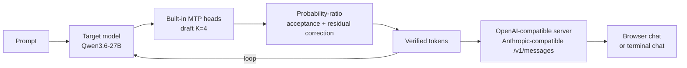
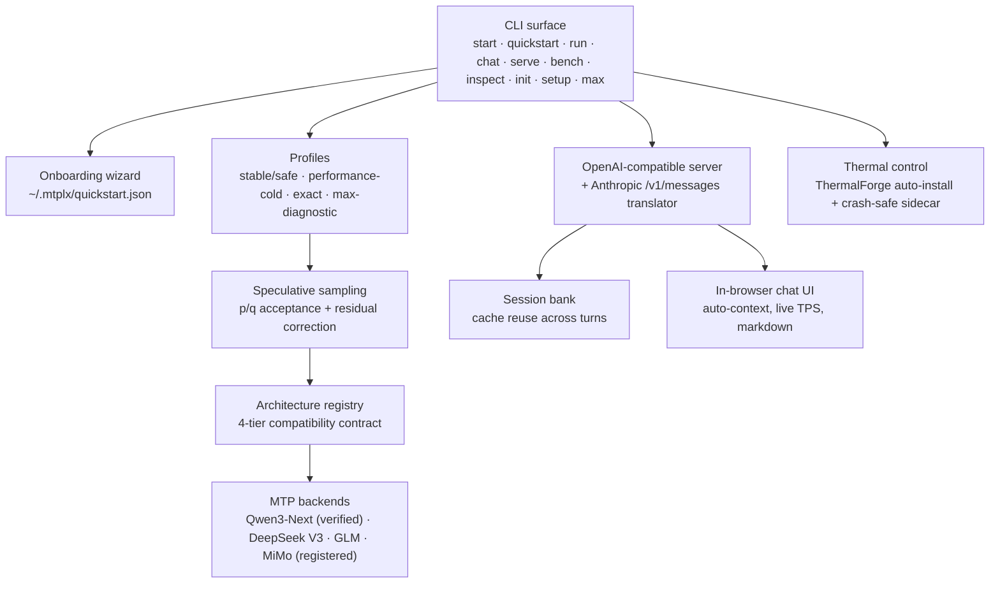

<div align="center">

```
  ███╗   ███╗ ████████╗ ██████╗  ██╗      ██╗  ██╗
  ████╗ ████║ ╚══██╔══╝ ██╔══██╗ ██║      ╚██╗██╔╝
  ██╔████╔██║    ██║    ██████╔╝ ██║       ╚███╔╝
  ██║╚██╔╝██║    ██║    ██╔═══╝  ██║       ██╔██╗
  ██║ ╚═╝ ██║    ██║    ██║      ███████╗ ██╔╝ ██╗
  ╚═╝     ╚═╝    ╚═╝    ╚═╝      ╚══════╝ ╚═╝  ╚═╝
```

# **Native MTP speculative decoding on Apple Silicon**

**60+ tok/s** on Qwen3.6-27B · math-correct rejection sampling at `temp=0.6` · MLX-native · zero external drafter

[](https://github.com/youssofal/mtplx/actions/workflows/ci.yml)
[](https://www.python.org/)
[](https://developer.apple.com/metal/)
[](CHANGELOG.md)
[](LICENSE)

</div>

---

MTPLX runs **the model's own built-in MTP heads** as a speculative drafter, with **exact probability-ratio acceptance + residual correction** — not the greedy-argmax trick most fast-decode tools use at T>0. That means real coding settings (`temperature=0.6`, `top_p=0.95`, `top_k=20`) actually get the speculative speedup *and* keep the target model's distribution.

This is **not** DFlash, DDTree, llama-spec, or an external-drafter system. It's a native-MTP runtime built around MLX, Apple Silicon, and a real OpenAI/Anthropic-compatible serving surface.

```bash
gh release download v0.1.0-preview.1 --repo youssofal/mtplx \
  --pattern 'mtplx-0.1.0rc1-py3-none-any.whl' \
  --pattern 'install_preview_global.sh'
bash install_preview_global.sh ./mtplx-0.1.0rc1-py3-none-any.whl

mtplx start            # interactive: pick model → mode → web/CLI, then chat
```

That's it. The wizard handles the default speed model (`Youssofal/Qwen3.6-27B-MTPLX-Optimized-Speed`), runtime mode, and surface (browser chat at `127.0.0.1:8000/` or terminal chat) on first run. On every subsequent run it asks "same as last time?" so you're one keypress from chatting.

---

## What you get

- **Native MTP speculative decoding.** Built-in MTP heads, no external drafter, no RAM hit for a second model.
- **Math-correct sampling at T=0.6.** Probability-ratio acceptance with residual correction. Verified `max_diff = 0.0` against reference single-token AR on the verified Qwen3.6-27B path.
- **60+ tok/s cold on a 27B-class model.** Verified D3/192 long-code at 60.169 tok/s (Apple Silicon M5 Max, no fan boost, MLX-native, 2026-04-29).
- **Real serving surface.** OpenAI-compatible `/v1/chat/completions` + `/v1/completions` + `/v1/models`, Anthropic-compatible `/v1/messages` (streaming SSE), `/health`, `/metrics`. Plug it into Open WebUI, Claude Code, Cline, Continue, or anything that speaks OpenAI.
- **In-browser chat UI** with auto-detected model context (256k for Qwen3.6), live tokens-per-second, markdown rendering, code-block copy buttons, a stop button, and a settings sidebar that persists per-machine.
- **Interactive start wizard.** Pick model, mode, and surface in three numbered prompts. Returning users get "same as last time?". No flag-soup required.
- **Honest profile names that tell you what they do.**
  - `Medium` — default native-MTP speed path (`performance-cold`), about 2.2× burst over the same model with MTP off, not sustained without fan control.
  - `Max` — Medium + ThermalForge fans pinned at 100%, about 2.24× in the measured speed lane, loud by design.
  - `Stable` — hidden compatibility flag (`--profile stable` / `--profile safe`) for the exact/staged long-reply path.
- **Crash-safe fan control.** When Max is on, MTPLX spawns a detached watchdog that restores fans to auto if the parent dies for any reason — including `kill -9` and "I closed the terminal". Verified live on hardware.
- **Idle-aware Max mode.** Server tracks request activity; after 15 minutes of no chat, fans drop to auto, then ramp back up on the next message.
- **Four-tier model compatibility contract.** `mtplx inspect <model>` reports: verified / arch-compatible-unverified / incompatible-architecture / no-MTP. No silent garbage runs.
- **Lazy imports.** `mtplx --help`, `doctor`, `inspect`, `init`, `setup` work on a fresh venv *without MLX installed*. Generation and serving pull in MLX only when needed.
- **Preview status: 350-test suite green**, including end-to-end onboarding, fan-control crash safety, OpenAI server fake-state, lazy-import survival, exactness gates.

> **Preview honesty.** The cold path is verified at 60+ tok/s. *Sustained* no-fan long-context throughput is currently ~37 tok/s on Flappy 10k versus a ≥50 tok/s target — the v0.1 release ships with this gap explicit. Closing it is the v0.2 deliverable; see [Roadmap](#roadmap).

---

## Quick start (full)

```bash
# 1. Install (preview wheel from GitHub release)
gh release download v0.1.0-preview.1 --repo youssofal/mtplx \
  --pattern 'mtplx-0.1.0rc1-py3-none-any.whl' \
  --pattern 'install_preview_global.sh'
bash install_preview_global.sh ./mtplx-0.1.0rc1-py3-none-any.whl

# 2. Verify the install
mtplx help
mtplx doctor --json

# 3. Chat (the wizard does everything)
mtplx start
```

Power-user shortcuts (any of these skip the wizard):

```bash
mtplx start --fresh                         # re-run the wizard from scratch
mtplx start cli                             # terminal chat directly
mtplx start --max                           # browser chat with fan boost
mtplx start --model /path/to/model          # use a specific local or HF model
mtplx pull Youssofal/Qwen3.6-27B-MTPLX-Optimized-Speed
mtplx quickstart --port 8000                # API server only, no chat
```

OpenAI-compatible smoke test:

```bash
curl http://127.0.0.1:8000/v1/chat/completions \
  -H 'Content-Type: application/json' \
  -d '{"model":"mtplx","messages":[{"role":"user","content":"hi"}],"stream":true}'
```

Public `pip install mtplx` is the Stage C target after PyPI Trusted Publishing is configured. The preview installer writes a durable launcher at `~/.local/bin/mtplx` (and `/opt/homebrew/bin/mtplx` when writable), so `mtplx` works from any new terminal without activating a venv.

---

## How it actually works

Most "fast decode on Apple Silicon" projects fall into one of three buckets:

| Approach | What they do at T>0 | What MTPLX does |
|---|---|---|
| llama.cpp / mlx-lm AR | No speculation, target model only | Speculative with a built-in drafter |
| DFlash, prefix-match speculation | Greedy-argmax equality (silently breaks at T>0) | Probability-ratio acceptance + residual correction |
| External-drafter speculation | Loads a second model into RAM | Uses the target's own MTP heads — zero extra RAM |

The math-correctness wedge is real. At `temperature=0.6`, the difference between "rejected because the draft argmax disagrees" and "rejected via the Leviathan/Chen rejection-sampling theorem" is the difference between a benchmark trick and a runtime your code editor can trust. MTPLX does the latter, including residual correction `(p − q)+` for the cases where the draft was rejected.

**Verified evidence:**
- D3/192 long-code, native MTP, exact T=0.6 / top_p=0.95 / top_k=20 speculative sampling: **60.169 tok/s** (clean preflight, 2026-04-29 14:37 BST). 2.54× over matched no-MTP AR (23.59 tok/s) on the same hardware.
- Per-position acceptance at depth 4: `[97.62%, 95.24%, 88.10%, 75.61%]` — higher than the published vLLM MTP-5 numbers at every depth.
- Distribution exactness vs reference single-token AR: `max_diff = 0.0`.



No second model, no greedy hack, no external drafter, no silent distribution drift.

---

## Modes

Picked by `mtplx start`, or set explicitly via `--profile`. Every mode preserves exactness; the difference is the runtime path and whether MTPLX touches your fans.

| Mode | Profile | Mechanics | Speed lane | Best for |
|---|---|---|---|---|
| **Medium** | `performance-cold` | Native-MTP speed path, Apple fan curve | ~2.2× burst, not sustained | Default first run, short replies, snappy chat |
| **Max** | `performance-cold` + `--max` | Medium path plus ThermalForge pinned to 100% | ~2.24× in the measured lane | Sustained workloads, you don't mind fans |
| **Stable** | `stable` / `safe` | Exact/staged long-reply path, hidden from onboarding | Lower peak speed, steadier shape | Compatibility and conservative long replies |

`Max` requires ThermalForge. `mtplx max --install` installs it from source into `~/.mtplx/bin/thermalforge`, sets up a passwordless sudoers rule scoped to that one binary, and verifies fans actually ramp before declaring success. One sudo prompt, end-to-end. Crash safety covers SIGINT, SIGTERM, SIGHUP, terminal close, and `kill -9` via a detached sidecar process.

---

## Compatibility

```bash
mtplx inspect <model-path-or-hf-repo> --json
```

| Tier | Means | Behavior |
|---|---|---|
| **Verified** | Has `mtplx_runtime.json` and passed MTPLX gates | Runs |
| **Arch-compatible, unverified** | Qwen3-Next MTP markers detected, no runtime contract | Refuses unless `--unsafe-force-unverified` |
| **Incompatible architecture** | MTP exists but not Qwen3-Next | Clear error, roadmap pointer |
| **No MTP** | No MTP head detected | Clear error, no garbage runs |

v0.1 ships verified Qwen3.6-27B via `Youssofal/Qwen3.6-27B-MTPLX-Optimized-Speed`, with public served model id `mtplx-qwen36-27b-optimized-speed`. The compatibility registry already detects DeepSeek V3 / V3.2, GLM-4 MoE / MoE-Lite, MiMo, and MiniMax M2 — unsupported runtime families stay behind explicit compatibility gates rather than silently running.

### Support matrix

| Area | Preview support |
|---|---|
| Mac | Apple Silicon only (`arm64`) |
| macOS | 14.0+; Sequoia is supported |
| Python | native arm64 Python 3.10+ |
| MLX | `python3 -m pip install mlx` in the same native environment |
| Memory | dynamic preflight; warns below 48 GiB, fails when the selected model/profile estimate exceeds 80% of unified memory |
| Storage | first download requires `max(model_size * 2.5, model_size + 20 GiB)` free on the model-cache filesystem |
| Docker/Open WebUI | Docker Desktop current plus previous two macOS major releases |

Run `mtplx doctor --summary`, `mtplx doctor --deep --json`, or `mtplx doctor --bundle` before filing a bug. Bundles are redacted by default under `~/.mtplx/reports/`.

---

## CLI surface

```bash
mtplx start                 # interactive setup, then chat
mtplx help                  # detailed help; `mtplx help <command>` for any
mtplx doctor                # install + model + integration health
mtplx inspect <model>       # four-tier compatibility report
mtplx init                  # write ~/.mtplx/config.toml
mtplx setup                 # download verified model, prepare cache
mtplx pull                  # download the default HF model safely
mtplx models                # cached models, validation, size, delete command
mtplx run "..."             # one-shot ask
mtplx chat                  # terminal chat
mtplx start                 # OpenAI/Anthropic-compatible server
mtplx connect openwebui     # paste settings for Open WebUI
mtplx openwebui docker-command
mtplx bench run --suite cold-long-code-192
mtplx max --install         # install ThermalForge for Max mode
mtplx max --status          # fan / thermal state
```

Every command has `--json` for machine-readable output and `--help` for context-specific docs.

---

## Architecture



---

## Roadmap

**v0.1.0-preview.1 (today).** Verified Qwen3-Next-MTP cold path, OpenAI/Anthropic-compatible serving, in-browser chat, interactive `mtplx start` wizard, four-tier compatibility, crash-safe Max mode, lazy-import CLI surface, 350-test suite green.

**v0.2 — sustained throughput.** Diagnostic-gated kernel ladder targeting `last64/first64 ≥ 0.90` no-fan on 10k generations while preserving the 60 tok/s class. Mechanism-driven: lazy-graph severance + output narrowing if graph history is the bottleneck; MLX-primitive-registered cache-update + `mx.compile` if dispatch tax dominates; an owned GDN+MLP verify-cycle kernel via `mx.fast.metal_kernel` only if the cheaper paths don't close the gap.

**v0.3 — broader fleet.** DeepSeek V3 / V3.2 MTP backend (registered, runtime pending), GLM-4 MoE backend, MiMo backend, generic MTP backend behind `mtplx_runtime.json`. PyPI public release. Optional Homebrew tap. Multi-session server concurrency.

The kernel-ladder direction is grounded in a six-agent deep-research synthesis (Compass / GPT Pro / Gemini ×2 / Claude ×2 / final validation pass) plus a closed-branch failure ledger that's already 35+ entries deep. We don't ship benchmark theater.

---

## What MTPLX is *not*

- It's not DFlash. DFlash uses greedy-argmax prefix matching and breaks the target distribution at T>0. MTPLX implements exact probability-ratio rejection sampling.
- It's not an external-drafter system. There's no second model. The drafter is the target's own MTP heads.
- It's not a generic "speculative decoding library". It's a runtime + serving stack with an explicit model-compatibility contract.
- It's not a CUDA project. MTPLX is MLX-native and Apple-Silicon-first. Linux/CUDA is not on the roadmap; for that, use vLLM.
- It's not finished. v0.1 is a preview. The 60 tok/s cold target is met, the sustained target is not, and the README says so.

---

## Attribution

MTPLX builds on [MLX](https://github.com/ml-explore/mlx) and the Qwen3-Next model family. The speculative-sampling math follows Leviathan & Chen 2023 ("Fast Inference from Transformers via Speculative Decoding") and the MTP heads ship with Qwen. Design and diagnostics are informed by vLLM speculative decoding, vLLM-Metal (issues #188 and #281), DFlash-MLX, DDTree-MLX, and DeepSeek V3.2's `mx.depends` precedent. Optional fan control via [ThermalForge](https://github.com/ProducerGuy/ThermalForge). Model weights and licenses remain governed by their upstream model cards.

— Built by [@youssofal](https://github.com/youssofal). Contributions, bug reports, and benchmark replications welcome via [Issues](https://github.com/youssofal/mtplx/issues).
