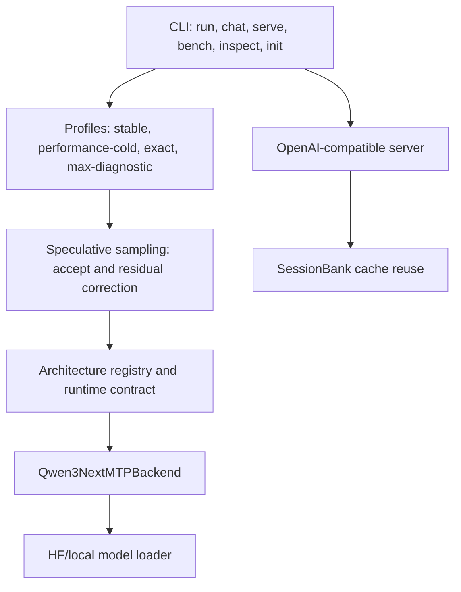

# MTPLX

Native MTP speculative decoding for Qwen3-Next on Apple Silicon.

[](https://github.com/youssofal/mtplx/actions/workflows/ci.yml)
[](https://www.python.org/)
[](https://developer.apple.com/metal/)
[](LICENSE)
[](CHANGELOG.md)

> Preview status: v0.1.0-preview ships the clean install surface, the verified cold MTP path, honest benchmark reporting, and OpenAI-compatible serving work in progress. Sustained no-fan long-context throughput is currently below target: recent Flappy 10k evidence is about 37 tok/s no-fan versus a 50+ tok/s goal. The default profile is `stable`. The cold 60+ tok/s path is opt-in as `--profile performance-cold`; `--max` is opt-in and is never required for the headline quick start.

```bash
pip install mtplx
mtplx doctor --json
mtplx inspect model --model mtplx/Qwen3.6-27B-MTPLX-GDN8-Speed4-CyanKiwiMTP --json
mtplx init
mtplx serve --port 8000
```

MTPLX is for developers who want local, Apple-Silicon-native text inference with the model's built-in MTP heads instead of a separate draft model. It targets terminal workflows, Open WebUI, local coding harnesses, and OpenAI-compatible clients.

## Why It Exists

Qwen3-Next models expose built-in MTP heads. MTPLX uses those heads for exact speculative sampling: proposal, probability-ratio acceptance, and residual correction. That keeps the sampler mathematically honest at normal coding settings such as `temperature=0.6`, `top_p=0.95`, and `top_k=20`.

MTPLX is not DFlash, DDTree, or an external-drafter system. It is a native-MTP runtime built around:

- built-in model MTP heads
- exact speculative sampling
- MLX on Apple Silicon
- terminal and OpenAI-compatible serving surfaces
- explicit model compatibility contracts

## Quick Start

```bash
python3 -m venv .venv
. .venv/bin/activate
python -m pip install -U pip
python -m pip install mtplx

mtplx doctor --json
mtplx init
mtplx inspect model --model /path/to/model --json
```

After selecting or downloading a verified model:

```bash
mtplx run "Write a small Python function that parses a TOML file."
mtplx chat
mtplx serve --port 8000
```

OpenAI-compatible smoke:

```bash
curl http://127.0.0.1:8000/v1/chat/completions \
  -H 'Content-Type: application/json' \
  -d '{"model":"mtplx","messages":[{"role":"user","content":"hello"}],"stream":true}'
```

## Performance Honesty

| Mode | Intended use | Status |
|---|---|---|
| `stable` | Default first-run profile | Conservative and predictable |
| `performance-cold` | Opt-in cold throughput | Preserves the verified 60+ tok/s cold path |
| `exact` | QA and release gates | Correctness-first |
| `max-diagnostic` | Fan-controlled diagnostics | Not used for product claims |

Every public benchmark number must include hardware, model, quantization, sampler, token count, profile, fan mode, date, and commit. The current known gap is sustained no-fan long-context throughput. v0.2 focuses on the kernel-ladder track that reduces dispatch count and watts/token instead of hiding the gap behind fan control.

## Compatibility

| Tier | Meaning | Runtime behavior |
|---|---|---|
| Verified | Model includes `mtplx_runtime.json` and has passed MTPLX gates | Runs normally |
| Architecture-compatible, unverified | Qwen3-Next MTP markers detected, no runtime contract | Refuses by default; `--unsafe-force-unverified` is required |
| Incompatible architecture | MTP exists but architecture is not supported in v0.1 | Clear error with roadmap pointer |
| No MTP | No MTP head detected | Clear error; MTPLX requires MTP-equipped models |

v0.1 supports Qwen3-Next-MTP only. DeepSeek V3 MTP, Llama-MTP, and generic MTP backends are roadmap items.

## Command Map

```bash
mtplx doctor --json
mtplx inspect model --model /path/or/hf/repo --json
mtplx init
mtplx run "hello"
mtplx chat
mtplx bench run --suite cold-long-code-192 --max-tokens 192
mtplx serve --port 8000
mtplx max --status
```

Server knobs that matter for local app integration:

```bash
mtplx serve --port 8000 --stream-interval 1 --warmup-tokens 16
mtplx serve --host 0.0.0.0 --port 8000 --api-key "$MTPLX_AUTH"
```

`--max` is intentionally absent from the quick start. It is opt-in only:

```bash
mtplx max --status
mtplx serve --max --profile max-diagnostic
```

## Architecture



## Roadmap

- v0.1.0-preview: clean install, no-MLX CLI survival, honest docs, Qwen3-Next verified path, OpenAI baseline.
- v0.2: sustained no-fan kernel ladder, dispatch/watts reduction, DeepSeek V3 investigation.
- v0.3: broader architecture registry, better server concurrency, optional Homebrew tap.

## Attribution

MTPLX builds on MLX and the Qwen model family. Its design is informed by vLLM speculative decoding, vLLM-Metal work, and local MLX runtime research. Model weights and licenses remain governed by their upstream model cards.
