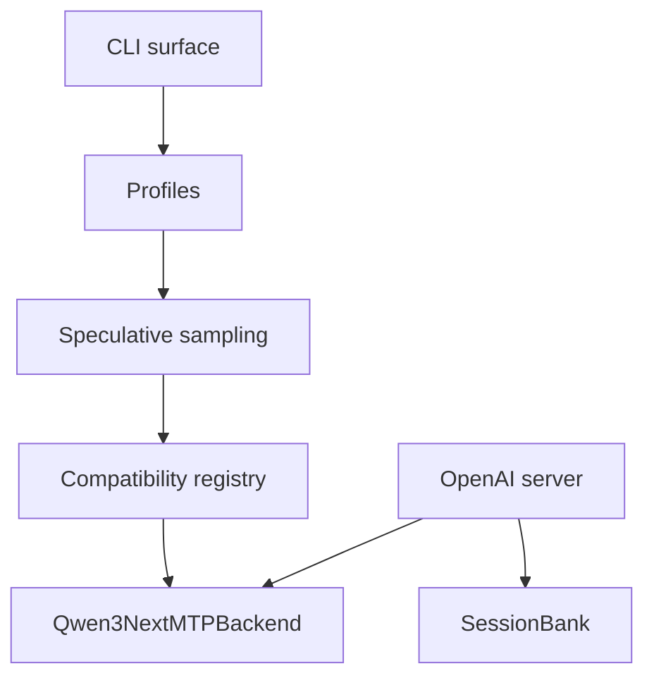

# Architecture

MTPLX is organized around a small public CLI, profile selection, a model compatibility registry, and a backend that owns architecture-specific MTP details.

The speculative sampler should remain backend-agnostic. Backends provide proposal and verification mechanics for a specific model family.
